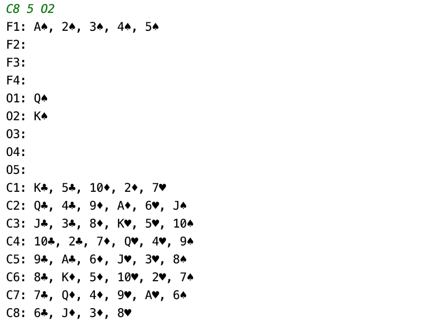
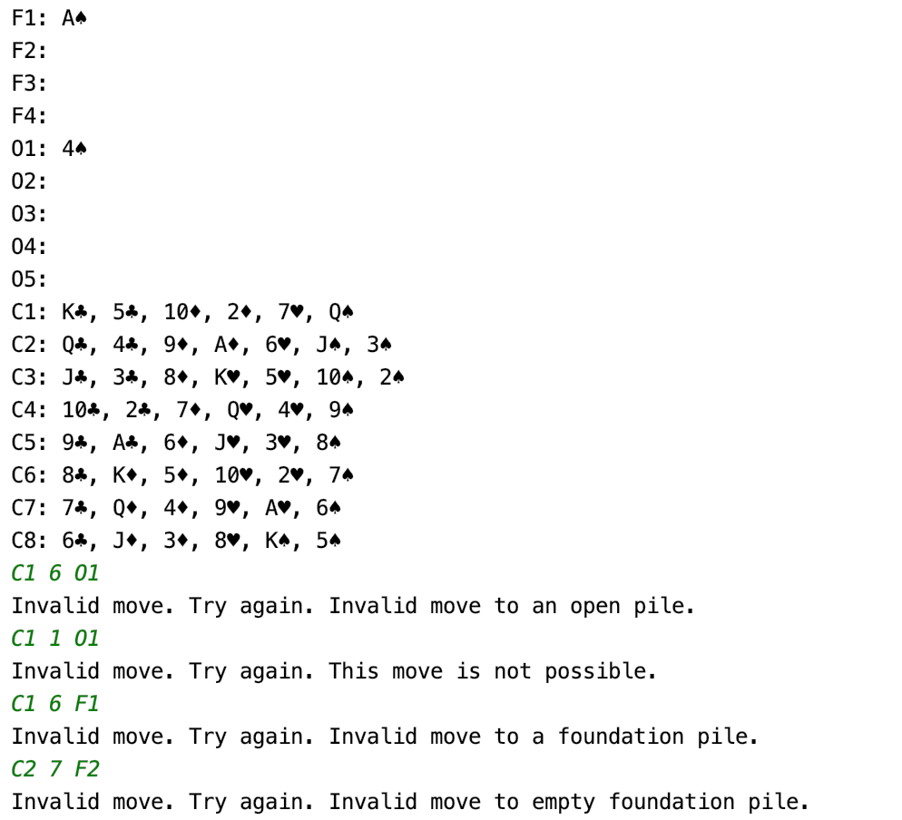

## Freecell Solitaire
This is a freecell game played through the command line. The user moves cards by providing three arguments: the source pile, the card index, and the destination pile. Meaningful error messages are displayed when the user inputs an invalid move. The game is created using Java and uses the MVC design pattern.

## Screenshots

